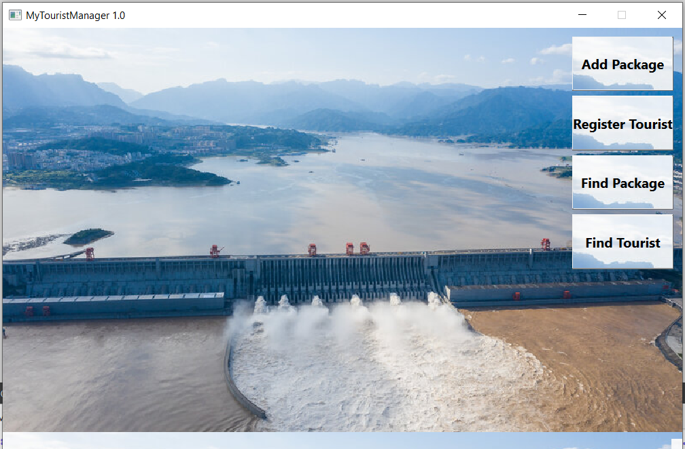
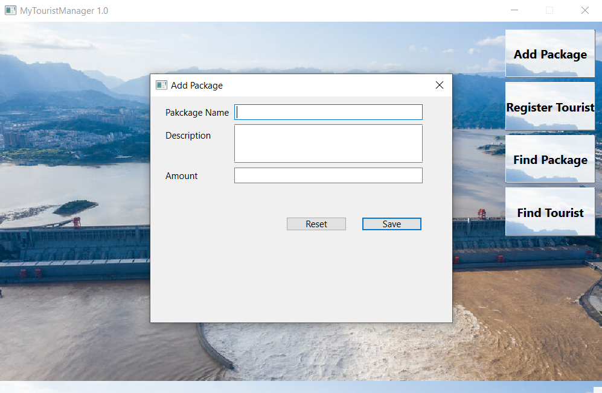
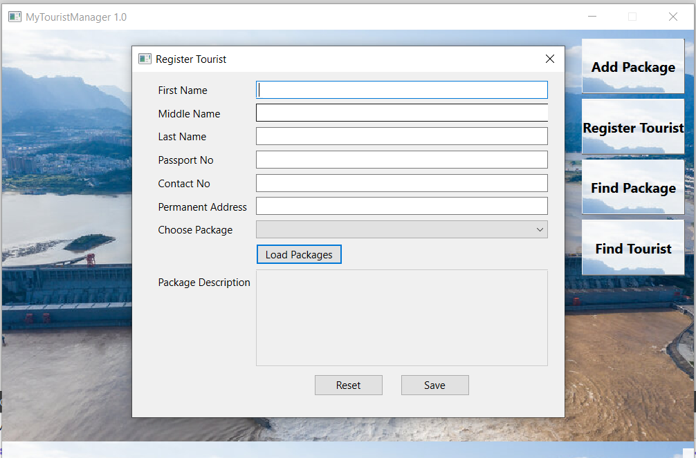

# tourist-manager
This C++ GUI project focuses on Tourist Management using the Qt 6 framework and one SQLite database. The system allows users to manage tourist information, add packages, and register tourists.

## Features
Add Packages: Users can add new tour packages to the system, providing package details such as name, description, and amount.

Register Tourists: The system allows the registration of tourists with relevant information.

Find Package: Users can search for available tour packages in the system.

Find Tourist: Users can search for registered tourists in the system.

## Screenshots

